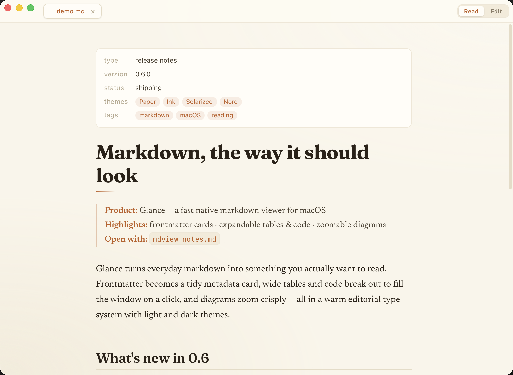

# Glance

A lightweight macOS markdown viewer and editor. Defaults to formatted view. Designed as a companion to terminal-based workflows — Claude Code can open any markdown file it creates with `mdview <path>` for immediate review.



## Features

- **Tabbed single window** — every `mdview <file>` call opens in the same window; duplicate paths are deduped.
- **Claude annotation review** — select text, leave a comment, and Claude can read and resolve your notes via MCP.
- **Rendered ↔ source toggle** — `⌘E` switches between formatted view and a CodeMirror editor.
- **GFM rendering** — GitHub Flavored Markdown with syntax-highlighted code blocks (highlight.js).
- **Explicit save** — `⌘S` writes the file and clears the dirty dot. No autosave.
- **Smart auto-reload** — when a file changes on disk, clean tabs refresh silently; dirty tabs prompt "Keep mine / Load disk".
- **Single-instance** — `mdview` reuses the running Glance window; no duplicate processes.
- **Session restore** — open tabs are saved at quit and restored on next launch.
- **Deleted-file marker** — tabs whose files have been removed are marked visually.
- **macOS light/dark** — follows the system appearance.
- **Native macOS menu** — app (Glance) and Edit menus with the standard editing shortcuts (undo/redo, cut/copy/paste/select-all) and Quit. The Glance menu also has **"Set up AI Integration…"** and **"Remove AI Integration…"**. App actions (⌘E toggle, ⌘S save) are handled in-window via keyboard shortcuts.

## Install

### Homebrew (recommended)

```bash
brew install --cask ncrohn/glance/glance
```

Apple Silicon only. Installs the notarized `Glance.app` into `/Applications`. Then open Glance and run **Glance ▸ Set up AI Integration…** to wire up the `mdview` CLI and Claude/Cursor integration.

### Manual (.dmg)

Prefer not to use Homebrew? Download `Glance_<version>_aarch64.dmg` from the [latest release](https://github.com/ncrohn/glance/releases/latest), open it, and drag `Glance.app` to `/Applications`. Then open Glance and run **Glance ▸ Set up AI Integration…**. Apple Silicon only.

### From source (development)

**Requirements:** Rust toolchain (stable), pnpm.

```bash
bash scripts/install.sh
```

Builds Glance in release mode, copies `Glance.app` to `/Applications`, and installs the `mdview` wrapper into `~/.local/bin` (same as the **Set up AI Integration…** menu item).

> Building a signed + notarized DMG for distribution — and cutting a release — is documented in [`RELEASING.md`](RELEASING.md).

## Usage

```bash
mdview path/to/file.md        # open a file (relative or absolute path)
mdview                        # open Glance with no file
```

Relative paths are resolved against the working directory before being forwarded to the app, so `mdview` works correctly from any directory.

If Glance is already running, the file is added as a new tab in the existing window. If the same path is already open, that tab is focused.

## For Claude Code

Claude can open any markdown doc it creates with `mdview` for immediate review:

```bash
mdview /absolute/path/to/file.md
```

- Works from any working directory (paths are resolved before forwarding).
- Reuses the running Glance window — no new app launches.
- Auto-refreshes when Claude rewrites the file (clean tabs update silently).

Optionally, add this line to your `~/.claude/CLAUDE.md` so Claude prefers `mdview` for surfacing markdown:

```
When creating or updating a markdown file that the user should review, open it with `mdview <absolute-path>`.
```

## AI integration

**Glance ▸ Set up AI Integration…** wires everything up in one click. It installs the shared `mdview` CLI once, then configures every supported client it detects on your machine (Claude Code today; Cursor gets the MCP server + a rules doc). For Claude Code:

1. Installs the `~/.local/bin/mdview` CLI wrapper.
2. Registers the bundled `glance-mcp` server into `~/.claude.json` under `mcpServers.glance`. The command path points to the binary inside the running `Glance.app`, so it works on any machine where Glance is installed and survives app updates.
3. Appends a review guidance block to `~/.claude/CLAUDE.md` (idempotent — safe to run again).
4. Installs a `glance` agent skill at `~/.claude/skills/glance/SKILL.md`. The skill teaches Claude the review-comment loop: open a file with `mdview`, read open comments with `list_annotations`, make the changes, then call `resolve_annotation` on each comment. It also describes how to interpret anchor states (`exact`, `quote-only`, `drifted`, `orphaned`) so Claude handles drifted or ambiguous annotations correctly.
5. Installs an auto-open hook (`~/.claude/skills/glance/open-md-hook.sh`) and registers it as a `PostToolUse`/`Write` entry in `~/.claude/settings.json`. Whenever Claude writes a `.md` file inside the current project directory, the hook opens it in Glance automatically — so you see the document appear without running `mdview` yourself. The hook skips `node_modules`, dot-directories, and files outside the working directory, and always exits 0 so it can never block the agent.

All paths are derived from the running app's binary location, not this source checkout. Re-running setup is idempotent, so it doubles as the upgrade path — no migration needed. **Glance ▸ Remove AI Integration…** reverses the per-client connectors (leaving the shared `mdview` CLI in place).

### Review loop

1. Open a markdown file with `mdview`.
2. Select text in the rendered view and click **Comment** to attach a note.
3. In a Claude Code session, Claude calls `list_annotations` (MCP tool) to read your open comments with **current line numbers** — the server re-anchors every annotation against the live file on each read, so line numbers stay correct even after edits.
4. Claude makes the requested changes, then calls `resolve_annotation` to mark each comment resolved. The change is reflected live in Glance.

**v1 scope:** user → Claude (read + resolve). Claude-authored highlights are future work (v2).

### MCP tools

| Tool | What it does |
|---|---|
| `list_annotations` | List annotations on a file; filters by status (default: `open`). |
| `get_annotation` | Fetch one annotation by id with its current line range. |
| `resolve_annotation` | Mark an annotation resolved after applying the change. |

A `glance://annotations/{path}` resource is also registered for direct resource reads.

## Development

```bash
pnpm install            # install JS dependencies
pnpm tauri dev          # run in dev mode (hot reload)
pnpm test               # frontend unit tests (vitest)
cd src-tauri && cargo test   # Rust unit tests (CLI path resolution)
pnpm build              # production JS build
pnpm exec tsc --noEmit  # TypeScript type check
```

Tests: 5 frontend suites (22 tests) + 4 Rust CLI tests.

## License

[MIT](LICENSE) © 2026 Nicholas Crohn
