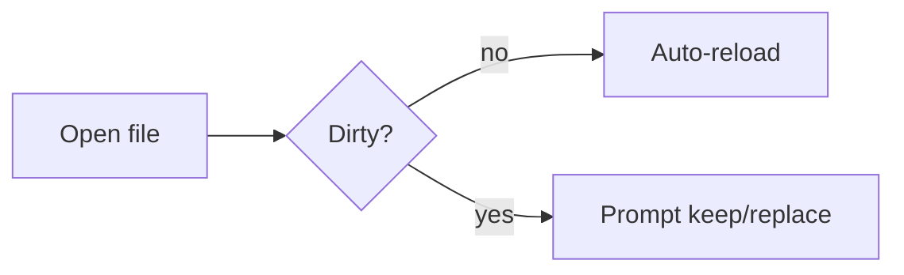

# Glance rendering test sheet

**Author:** Claude
**Purpose:** Exercise frontmatter, the leading meta line, wide tables, wide code, and task-list markup
**Updated:** 2026-07-20 20:45 — [source](https://example.com/spec)

---

## What to look at

- The **frontmatter card** above the H1: muted keys, `people` and `tags` as chips, empty `project` dropped, quoted `title` unquoted.
- This **meta line** (`**Author:** … **Purpose:** …`) — stacked rows with accent labels and a left rule, because it sits before the first `##`.
- The **wide table** and **code blocks** below — hover them and click the ⤢ button (top-right) to fill the pane; click again to collapse.
- The **task list** at the bottom — bold and `inline code` should stay on one flowing line, not shred into columns.

## Wide table (hover → expand)

| Round | Date | Amount | Lead investor | Post-money valuation | Board seat | Notes / other participants |
|---|---|---|---|---|---|---|
| Pre-seed | 2021-03 | $0.75M | Angel syndicate | undisclosed | no | Friends & family; convertible SAFE at $8M cap |
| Seed | 2022-01 | $4M | Foundry Group | ~$22M | yes | + Uncork, Hustle Fund, 12 angels from the design tooling world |
| Series A | 2023-06 | $18M | Benchmark | ~$95M | yes | + Foundry (pro-rata), notable operator angels from Figma & Linear |
| Series B | 2025-02 | $55M | Sequoia | ~$400M | yes | + Benchmark, Foundry, a sovereign fund (undisclosed), strong insider signal |
| Series C | 2026-05 | $130M | Tiger Global | >$1.2B | tbd | Crossover round; growth-stage terms; cap table now spans 40+ holders |

## Narrow table (should not need expanding)

| Key | Value |
|---|---|
| Environment | production |
| Region | us-east-1 |
| Replicas | 3 |

## Wide code (hover → expand)

```ts
// Long lines here overflow the reading column — expand to read without sideways scrolling.
export async function reconcile(state: State, incoming: DiskChange[], opts: { dryRun?: boolean; onConflict?: (a: Doc, b: DiskChange) => "keep-mine" | "take-theirs" } = {}): Promise<ReconcileResult> {
  const decisions = incoming.map((change) => ({ change, doc: state.docs.find((d) => d.absPath === change.path), verdict: decideReload(state.docs.find((d) => d.absPath === change.path)) }));
  return { applied: decisions.filter((d) => d.verdict === "auto-reload").length, prompted: decisions.filter((d) => d.verdict === "prompt").map((d) => d.change.path) };
}
```

```bash
# A wide shell one-liner
docker run --rm -it -v "$PWD":/work -w /work --env-file .env.production ghcr.io/example/toolchain:2026.07 bash -lc 'pnpm install --frozen-lockfile && pnpm build && pnpm exec vitest run --reporter=dot && echo "OK: build + tests green for $(git rev-parse --short HEAD)"'
```

## Prose, headings, and inline styles

Regular paragraph with **bold**, *italic*, `inline code`, a [link](https://example.com), and a footnote-ish aside. Below: a blockquote and nested lists.

> "Any sufficiently advanced rendering is indistinguishable from readable." — not a real quote

1. First ordered item
2. Second, with a nested list:
   - sub-bullet with `code`
   - sub-bullet with **bold**
3. Third

## Task list (the shredding regression)

- [x] Complete **Code Signal take-home** ✅ 2026-07-17 — from [[some-wikilink]] (passed the screen)
- [ ] **Tech-lead casual convo** — be personable, tight NestJS/Postgres story, 2–3 team Qs 🔼
- [ ] Prep: **real Postgres + TypeORM migrations from scratch** — drill at `~/dev/solace-migrations-drill`, AI-off ⏫
- [ ] Prep: **React reps** (component + form + data-fetch) — named in the onsite stack list 🔽
- [ ] A deliberately long task item to force wrapping onto a second line so you can confirm the wrapped text aligns under the label and **not** under the checkbox, with a trailing `inline code path/to/thing` for good measure

## Mermaid (unaffected by expand — for contrast)


